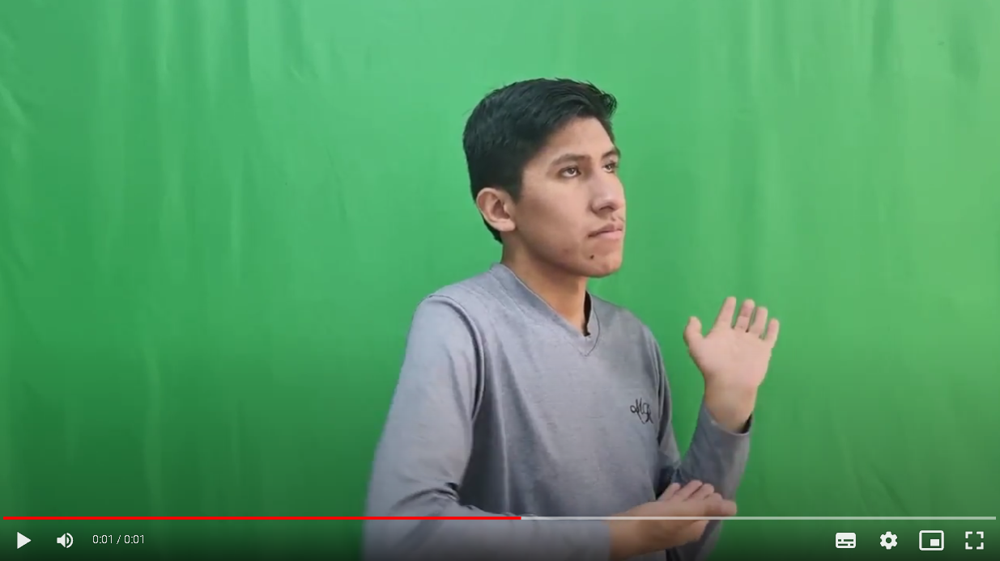

# Bolivian Signal Detection (BSD)
The project is Sign language detection from finger and face trajectory. For this it was necessary to create a dataset consisting of videos of 20 different signs, from this dataset we proceeded with the pre-processing part to normalize the number of frames and the size of the videos.  Mediapipe was then used to record the trajectories of the hand and parts of the face such as the eyes. Finally, a model was applied for data training, evaluation and testing.

## Motivation
This project took as a reference a problem present in society: social inclusion. We consider that a group of people who often lack opportunities are those with hearing disabilities, in that sense we wanted to support inclusion through this model that allows to recognize sign language automatically, in this way we achieve a support for a more effective communication.

## Screenshots

Folder with 20 corresponding signs:

Videos recorded for the dataset:

Vídeos normalizados:

Images generated with Mediapipe:

## Tecnologies
- Mediapipe
- Tensorflow 
- Google Drive
- Google Colab

## Important functionalities
Responder: ¿Cuáles son las funcionalidades mas interesantes de tu proyecto?

## Instalation
Proveer de una guía paso a paso con ejemplos sobre como obtener un ambiente de desarrollo corriendo con el presente repositorio. 
En el caso de tener varios repositorios, realizar la guía correspondiente para cada uno.

## Credits
List of participants for this project:
- Ever Imanol Alavi Gallardo
- Natalia Lourdes Condori Peredo
- Weimar Adalid Condori Yupanqui
- Carlos Mauricio Fernadez Aldayuz
- Diego Alfredo Rodríguez Martinez

## License

The MIT License

Copyright (c) 2023 [NDEAH]

Permission is hereby granted, free of charge, to any person obtaining a copy
of this software and associated documentation files (the "Software"), to deal
in the Software without restriction, including without limitation the rights
to use, copy, modify, merge, publish, distribute, sublicense, and/or sell
copies of the Software, and to permit persons to whom the Software is
furnished to do so, subject to the following conditions:

The above copyright notice and this permission notice shall be included in
all copies or substantial portions of the Software.

THE SOFTWARE IS PROVIDED "AS IS", WITHOUT WARRANTY OF ANY KIND, EXPRESS OR
IMPLIED, INCLUDING BUT NOT LIMITED TO THE WARRANTIES OF MERCHANTABILITY,
FITNESS FOR A PARTICULAR PURPOSE AND NONINFRINGEMENT. IN NO EVENT SHALL THE
AUTHORS OR COPYRIGHT HOLDERS BE LIABLE FOR ANY CLAIM, DAMAGES OR OTHER
LIABILITY, WHETHER IN AN ACTION OF CONTRACT, TORT OR OTHERWISE, ARISING FROM,
OUT OF OR IN CONNECTION WITH THE SOFTWARE OR THE USE OR OTHER DEALINGS IN
THE SOFTWARE.
